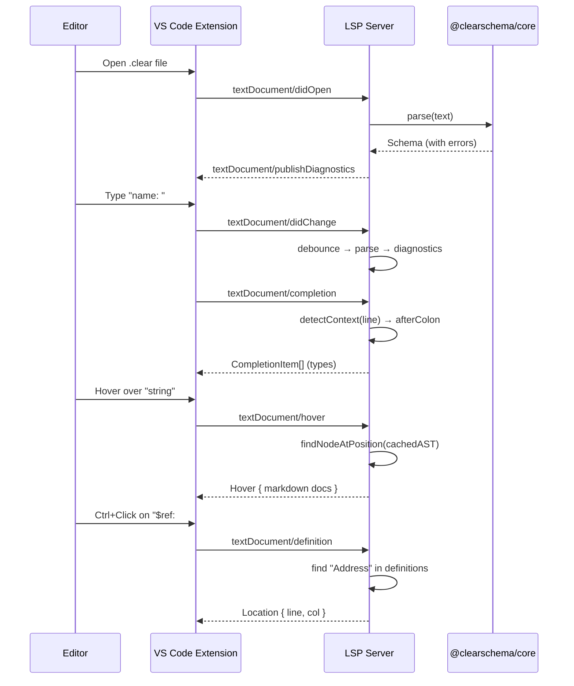

# feat: Add LSP server for ClearSchema editor intelligence

## Overview

Add a Language Server Protocol (LSP) server that provides real-time editor intelligence for `.clear` files: diagnostics, autocomplete, hover documentation, go-to-definition, and document symbols. The server is editor-agnostic (usable from VS Code, Neovim, Emacs, etc.) and the existing VS Code extension is upgraded to act as the LSP client.

## Problem Frame

ClearSchema has a parser with error recovery, source locations on all AST nodes, and a resolver for `$ref`/imports — the hard prerequisites for an LSP are already met. But users writing `.clear` files get no editor feedback beyond syntax highlighting. The LSP closes this gap: real-time error diagnostics as you type, autocomplete for types and modifiers, hover docs, go-to-definition for `$ref`, and outline navigation. This is idea #4 from the ideation doc and the last remaining feature from the original roadmap.

## Requirements Trace

- R1. Diagnostics: real-time parse errors with line/column as the user types
- R2. Type autocomplete: suggest `string`, `number`, `object`, etc. after `:` on field lines
- R3. Modifier autocomplete: suggest context-appropriate modifiers (`minLength` for string, `min` for number, etc.) after `^` on modifier lines
- R4. `$ref` autocomplete: suggest `$defs` names after `$ref:` or `#/$defs/`
- R5. Hover documentation: markdown docs for types, modifiers, and `$ref` targets
- R6. Go-to-definition: navigate from `$ref` usage to its `$defs` declaration
- R7. Document symbols: outline view showing definitions, root fields, and nested structure
- R8. Editor-agnostic: LSP server works with any LSP client, not just VS Code
- R9. VS Code extension updated to spawn and communicate with the LSP server

## Scope Boundaries

- Single-file analysis only — no cross-file workspace indexing for v1 (imports are not resolved in the LSP)
- No code actions, rename, find-all-references, or formatting — deferred to v1.1
- No incremental parsing — full re-parse on each change (viable for typical `.clear` file sizes < 500 lines)
- No VS Code marketplace publishing in this plan — that's a separate release step
- No snippet completions — only type/modifier/ref completions

## Context & Research

### Relevant Code and Patterns

- `clearschema/src/parser/parser.ts` — Parser with `synchronize()` error recovery. Returns `Schema` with `errors?: Error[]` array containing all accumulated parse errors with `SourceLocation`
- `clearschema/src/parser/errors.ts` — `ParseError` with `location: SourceLocation` (1-based line/column), `hint?: string`
- `clearschema/src/lexer/lexer.ts` — Line-oriented tokenizer with INDENT/DEDENT. Classifies whole lines, not sub-line tokens. `tokenize()` returns `{ tokens, errors }`
- `clearschema/src/ast/types.ts` — All AST nodes carry `location: SourceLocation`. Fields have `name`, `type`, `description`, constraints. `SchemaDefinition` has `name` and `field`
- `clearschema/src/resolver/resolver.ts` — `resolveReferences()` builds `definitionsMap` and sets `RefField.resolvedRef`. Not needed for v1 LSP (single-file, definitions are in the AST)
- `vscode-clearschema/` — Existing extension with TextMate grammar, no LSP, no TypeScript source
- `docs/phases/PHASE7_VSCODE_LSP.md` — Directional design sketches for all 6 capabilities
- `docs/GRAMMAR.md` — Complete EBNF grammar for autocomplete context detection

### External References

- `vscode-languageserver` ^9.0.0 — LSP server library for Node.js
- `vscode-languageclient` ^9.0.0 — VS Code LSP client library
- `vscode-languageserver-textdocument` ^1.0.0 — TextDocument abstraction
- LSP Specification 3.17 — Protocol definition
- VS Code Language Server Extension Guide — Best practices

## Key Technical Decisions

- **Separate LSP server package**: Create `clearschema-lsp/` as a sibling directory (like `playground/`). Depends on `@clearschema/core`. Editor-agnostic — any LSP client can use it. The VS Code extension becomes just a thin client
- **Full re-parse on change**: The parser is fast enough for typical schema files (< 500 lines). No incremental parsing needed. Debounce `onDidChangeContent` at ~300ms
- **TextDocumentSyncKind.Incremental**: Let the `TextDocuments` manager handle incremental sync (it maintains the full document internally). We still re-parse the full text each time
- **Line context detection for autocomplete**: The lexer is line-oriented. For autocomplete, analyze the current line text directly (regex on the line up to cursor position) rather than running the full parser. Detect: after first `:` → types, after `^` → modifiers, after `$ref:` → definition names, after `.` on type → `required`/`nullable`
- **1-based to 0-based conversion**: Parser uses 1-based line/column, LSP uses 0-based. A `locationToRange()` helper handles this everywhere
- **AST caching**: Cache the last successful parse result per document URI. Use it for hover, go-to-definition, and symbols even when the current document has parse errors
- **Transport**: IPC (fastest) for VS Code. The server also supports stdio for other editors
- **No runtime dependencies in core**: The LSP server depends on `@clearschema/core` and `vscode-languageserver`. The core package remains zero-dependency

## Open Questions

### Resolved During Planning

- **Where does the LSP server live?** Separate `clearschema-lsp/` package — editor-agnostic, testable in isolation
- **How to detect autocomplete context?** Regex on current line text, not full parse. The lexer classifies whole lines, so sub-line analysis needs direct string inspection
- **How to handle partial/incomplete input?** The parser already recovers from errors via `synchronize()`. For autocomplete, we analyze the raw line text — no parse needed
- **Should we use the resolver for go-to-definition?** No — for single-file, definitions are directly in `Schema.definitions`. Walk the AST to find the definition by name

### Deferred to Implementation

- Exact debounce timing (300ms starting point, tune based on feel)
- Whether `hint` from `ParseError` should appear as `DiagnosticRelatedInformation` or appended to the message
- Hover content formatting details (which constraints to show, markdown structure)

## High-Level Technical Design

> *This illustrates the intended approach and is directional guidance for review, not implementation specification. The implementing agent should treat it as context, not code to reproduce.*

```
clearschema-lsp/                         vscode-clearschema/
├── src/                                 ├── src/
│   ├── server.ts  ─── LSP connection    │   └── extension.ts ─── LSP client
│   │   ├── onInitialize (capabilities)  │       ├── spawn server process
│   │   ├── onDidChangeContent → parse   │       ├── TransportKind.ipc
│   │   └── wire handlers                │       └── documentSelector: clearschema
│   ├── diagnostics.ts                   │
│   │   └── parse() → Schema.errors     │
│   │       → Diagnostic[] (0-based)     │
│   ├── completion.ts                    │
│   │   ├── detectContext(line, col)      │
│   │   │   → afterColon / afterCaret /  │
│   │   │     afterRef / afterDot        │
│   │   └── return CompletionItem[]      │
│   ├── hover.ts                         │
│   │   ├── findNodeAtPosition(AST, pos) │
│   │   └── return Hover (markdown)      │
│   ├── definition.ts                    │
│   │   ├── detectRefAtPosition(text,pos)│
│   │   └── find in Schema.definitions   │
│   └── symbols.ts                       │
│       └── walk AST → DocumentSymbol[]  │
└── tests/                               │
    ├── unit/                            │
    └── integration/                     │
```



## Implementation Units

### Phase 1: LSP Server Foundation

- [ ] **Unit 1: LSP server scaffolding and diagnostics**

**Goal:** Create the LSP server package with connection setup, document sync, and real-time diagnostics from parse errors

**Requirements:** R1, R8

**Dependencies:** None

**Files:**
- Create: `clearschema-lsp/package.json`
- Create: `clearschema-lsp/tsconfig.json`
- Create: `clearschema-lsp/src/server.ts`
- Create: `clearschema-lsp/src/diagnostics.ts`
- Create: `clearschema-lsp/src/utils.ts` (locationToRange helper, AST cache)
- Test: `clearschema-lsp/tests/unit/diagnostics.test.ts`

**Approach:**
- `package.json` with `@clearschema/core` and `vscode-languageserver` + `vscode-languageserver-textdocument` dependencies. `"main": "dist/server.js"`, `"bin": { "clearschema-lsp": "dist/server.js" }`
- `server.ts`: createConnection, TextDocuments, onInitialize (declare all 6 capabilities), onDidChangeContent → validateDocument, wire all handlers
- `diagnostics.ts`: `validateDocument(text) → Diagnostic[]`. Call `parse(text)`, map `Schema.errors` to LSP `Diagnostic` objects (1-based → 0-based conversion). Include `ParseError.hint` in the message when present. Source: `'clearschema'`
- `utils.ts`: `locationToRange(loc: SourceLocation): Range` helper. `DocumentState` class that caches the last successful `Schema` per URI for use by other handlers
- Debounce diagnostics at ~300ms using a simple setTimeout/clearTimeout pattern (no lodash dependency)

**Patterns to follow:**
- `clearschema/src/exporters/json-schema.ts` for class + free function pattern
- `docs/phases/PHASE7_VSCODE_LSP.md` for diagnostics sketch
- `clearschema/src/parser/errors.ts` for ParseError structure

**Test scenarios:**
- Happy path: Valid `.clear` input → zero diagnostics
- Happy path: Input with one parse error → one diagnostic with correct 0-based line/column
- Happy path: Input with multiple errors → multiple diagnostics (parser error recovery)
- Edge case: Empty input → zero diagnostics (empty schema is valid)
- Edge case: ParseError with `hint` → hint included in diagnostic message
- Edge case: Lexer error (bad indentation) → diagnostic with correct location
- Integration: `locationToRange` converts 1-based SourceLocation to 0-based Range correctly

**Verification:**
- Server compiles and starts. Diagnostics return correct 0-based positions for known parse errors. AST cache stores last successful parse.

---

- [ ] **Unit 2: Autocomplete (types, modifiers, $ref targets)**

**Goal:** Provide context-aware completions: types after `:`, modifiers after `^`, definition names after `$ref:`, and inline modifiers after `.`

**Requirements:** R2, R3, R4

**Dependencies:** Unit 1

**Files:**
- Create: `clearschema-lsp/src/completion.ts`
- Test: `clearschema-lsp/tests/unit/completion.test.ts`

**Approach:**
- `detectContext(lineText, character)` function that analyzes the current line up to the cursor position. Returns a discriminated union: `{ kind: 'type' }`, `{ kind: 'modifier', fieldType: string }`, `{ kind: 'ref' }`, `{ kind: 'inlineModifier' }`, `{ kind: 'arrayItem' }`, or `{ kind: 'none' }`
- Context detection rules (regex on line text):
  - Line matches `^\s*\w+:\s*$` or cursor is right after the first `:` with no type yet → `type`
  - Line matches `^\s*\^` → `modifier`. Determine field type by walking backward through preceding lines to find the parent field's type
  - Line contains `$ref:` and cursor is after it → `ref`. Suggest definition names from cached AST
  - Cursor is after `.` following a type name → `inlineModifier` (suggest `required`, `nullable`, `tuple`)
  - Line matches `^\s*-\s*$` → `arrayItem` (suggest types)
- Type completions: all FieldTypeName values plus `$ref`, `allOf`, `anyOf`, `oneOf`, `map`
- Modifier completions keyed by parent field type:
  - string: minLength, maxLength, pattern, format
  - number/integer: min, max, exclusiveMin, exclusiveMax, multipleOf
  - array: minItems, maxItems, uniqueItems
  - universal: default, const, enum
- Ref completions: iterate `cachedSchema.definitions.map(d => d.name)`, format as `#/$defs/{name}`
- Each CompletionItem includes `detail` (one-line) and `documentation` (markdown) for the preview

**Patterns to follow:**
- `docs/phases/PHASE7_VSCODE_LSP.md` autocomplete sketch
- `docs/GRAMMAR.md` for trigger positions

**Test scenarios:**
- Happy path: Line `name: ` with cursor at end → type completions (string, number, object, etc.)
- Happy path: Line `  ^ ` with cursor after caret → modifier completions for parent field type
- Happy path: Line `  ^ ` under a string field → string modifiers (minLength, maxLength, pattern, format)
- Happy path: Line `  ^ ` under a number field → number modifiers (min, max, etc.)
- Happy path: Line `addr: $ref: ` with cursor after `$ref: ` → definition name completions from cached AST
- Happy path: Line `name: string.` with cursor after dot → inline modifier completions (required, nullable)
- Happy path: Line `  - ` with cursor after dash → type completions (array item context)
- Edge case: No cached AST → ref completions return empty array
- Edge case: Empty line → no completions
- Edge case: Comment line (`# `) → no completions
- Edge case: Modifier line under unknown/unresolvable field type → universal modifiers only

**Verification:**
- Each completion context returns appropriate items. Modifier completions are type-aware.

---

- [ ] **Unit 3: Hover documentation**

**Goal:** Show rich markdown documentation when hovering over types, modifiers, field names, and `$ref` targets

**Requirements:** R5

**Dependencies:** Unit 1

**Files:**
- Create: `clearschema-lsp/src/hover.ts`
- Test: `clearschema-lsp/tests/unit/hover.test.ts`

**Approach:**
- `getHover(text, position, cachedSchema)` → `Hover | null`
- Identify what's under the cursor by analyzing the line text and cursor column:
  - On a type keyword (string, number, etc.) → show type documentation with available modifiers
  - On a modifier name (after `^`) → show modifier documentation with example
  - On a `$ref` target → show the referenced definition's structure (field names and types)
  - On a field name → show the field's type, description, and constraints from the AST
- Type docs: name, description, list of available modifiers with brief explanations
- Modifier docs: name, description, value type, example `.clear` snippet
- Ref hover: show the definition's fields (name, type, required) as a summary table
- Field hover: show type, description, constraints, required/nullable status
- All content as `MarkupKind.Markdown`
- The "killer demo" feature: hover over a field → show what the exported JSON Schema would look like (call `exportJsonSchema` on a synthetic single-field schema and show the JSON)

**Patterns to follow:**
- `docs/phases/PHASE7_VSCODE_LSP.md` hover sketch
- `docs/ARCHITECTURE.md` for modifier tables per type

**Test scenarios:**
- Happy path: Hover over `string` type → markdown with type docs and modifier list
- Happy path: Hover over `minLength` modifier → modifier documentation with example
- Happy path: Hover over `$ref: #/$defs/Address` → summary of Address definition fields
- Happy path: Hover over field name `email` → type, description, constraints
- Edge case: Hover over whitespace → null (no hover)
- Edge case: Hover over comment → null
- Edge case: Hover over `$ref` to undefined definition → "Definition not found" message
- Edge case: No cached AST → fall back to static type/modifier docs only

**Verification:**
- Hover returns rich markdown for types, modifiers, refs, and fields. JSON Schema preview works.

---

### Phase 2: Navigation and Structure

- [ ] **Unit 4: Go-to-definition for $ref**

**Goal:** Ctrl+Click or F12 on a `$ref` reference navigates to the definition in `$defs`

**Requirements:** R6

**Dependencies:** Unit 1

**Files:**
- Create: `clearschema-lsp/src/definition.ts`
- Test: `clearschema-lsp/tests/unit/definition.test.ts`

**Approach:**
- `getDefinition(text, position, cachedSchema, documentUri)` → `Location | null`
- Detect if the cursor is on a `$ref` target: check if the line contains `$ref:` and the cursor is within the ref path portion
- Extract the definition name from the ref path (e.g., `#/$defs/Address` → `Address`, bare `Address` also works)
- Find the matching `SchemaDefinition` in `cachedSchema.definitions` by name
- Return `Location` with the definition's `location` (converted to 0-based)
- Also support go-to-definition on import paths (detect `import:` lines, but since v1 is single-file, return null for cross-file refs)

**Patterns to follow:**
- `docs/phases/PHASE7_VSCODE_LSP.md` definition sketch
- `clearschema/src/resolver/resolver.ts` for how definitions are looked up by name

**Test scenarios:**
- Happy path: Cursor on `#/$defs/Address` → Location pointing to Address definition
- Happy path: Cursor on bare `Address` in `$ref: Address` → same Location
- Edge case: Cursor on `$ref` to undefined name → null
- Edge case: Cursor not on a `$ref` line → null
- Edge case: No cached AST → null
- Edge case: Multiple definitions with same name (shouldn't happen, but first match wins)

**Verification:**
- Go-to-definition returns correct 0-based location for known `$defs` references.

---

- [ ] **Unit 5: Document symbols (outline)**

**Goal:** Provide document outline showing `$defs`, root fields, and nested object fields as a hierarchy

**Requirements:** R7

**Dependencies:** Unit 1

**Files:**
- Create: `clearschema-lsp/src/symbols.ts`
- Test: `clearschema-lsp/tests/unit/symbols.test.ts`

**Approach:**
- `getDocumentSymbols(cachedSchema)` → `DocumentSymbol[]`
- Walk `Schema.definitions` → each becomes a `DocumentSymbol` with `SymbolKind.Class`, children from the definition's field tree
- Walk `Schema.fields` → each becomes a `DocumentSymbol` with kind based on type (Object → `SymbolKind.Object`, Array → `SymbolKind.Array`, String → `SymbolKind.String`, etc.)
- Recurse into ObjectField.fields for nested symbols
- Each symbol has `name`, `kind`, `detail` (the type name), `range`, `selectionRange`

**Patterns to follow:**
- `docs/phases/PHASE7_VSCODE_LSP.md` symbols sketch

**Test scenarios:**
- Happy path: Schema with `$defs` + root fields → definitions as Class symbols, fields as typed symbols
- Happy path: Nested object → children appear as sub-symbols
- Happy path: Array field → SymbolKind.Array
- Edge case: Empty schema → empty array
- Edge case: No cached AST → empty array
- Edge case: Definition with deeply nested objects → multi-level hierarchy

**Verification:**
- Outline shows correct hierarchy matching the `.clear` file structure.

---

### Phase 3: VS Code Client Integration

- [ ] **Unit 6: VS Code extension LSP client**

**Goal:** Upgrade the existing VS Code extension to spawn the LSP server and connect as a client

**Requirements:** R9

**Dependencies:** Units 1-5

**Files:**
- Create: `vscode-clearschema/src/extension.ts`
- Modify: `vscode-clearschema/package.json` (add `main`, dependencies, activation)
- Create: `vscode-clearschema/tsconfig.json`

**Approach:**
- Add dependencies: `vscode-languageclient` ^9.0.0, `@types/vscode`
- `extension.ts`: LanguageClient setup with ServerOptions pointing to the LSP server module. TransportKind.ipc. DocumentSelector `[{ scheme: 'file', language: 'clearschema' }]`
- `package.json`: add `"main": "./dist/extension.js"`, add dependencies, keep existing grammar and language config
- Build with `tsc` to `dist/`
- The server module path resolves to `clearschema-lsp/dist/server.js` (the extension bundles or references it)

**Patterns to follow:**
- `docs/phases/PHASE7_VSCODE_LSP.md` extension structure
- VS Code LSP sample extension (microsoft/vscode-extension-samples/lsp-sample)

**Test expectation: none** — VS Code extension client is integration-tested manually by launching the extension in the Extension Development Host

**Verification:**
- Extension activates on `.clear` files. All 6 LSP features work in the editor: diagnostics underlines, autocomplete popup, hover tooltips, Ctrl+Click go-to-definition, and outline panel.

---

### Phase 4: Integration Testing and Documentation

- [ ] **Unit 7: Integration tests**

**Goal:** Verify the LSP server responds correctly to protocol messages end-to-end

**Requirements:** R1-R7

**Dependencies:** Units 1-5

**Files:**
- Create: `clearschema-lsp/tests/integration/lsp-protocol.test.ts`

**Approach:**
- Spawn the LSP server as a child process with stdio transport
- Send LSP protocol messages (initialize, textDocument/didOpen, textDocument/completion, etc.)
- Assert on responses
- Use `vscode-languageserver-protocol` types for message construction
- Test the full flow: open document → receive diagnostics → request completions → request hover → request definition → request symbols

**Test scenarios:**
- Integration: Initialize → capabilities include all 6 features
- Integration: didOpen with valid schema → zero diagnostics published
- Integration: didOpen with invalid schema → diagnostics published with correct positions
- Integration: didChange → diagnostics updated
- Integration: completion request on field line → type completions returned
- Integration: hover request on type keyword → markdown content returned
- Integration: definition request on $ref → location returned
- Integration: documentSymbol request → symbols with hierarchy returned

**Verification:**
- All protocol interactions produce correct responses. Server starts and stops cleanly.

---

- [ ] **Unit 8: Documentation and changelog**

**Goal:** Update CHANGELOG, README, and extension README for the LSP feature

**Requirements:** R1-R9

**Dependencies:** All previous units

**Files:**
- Modify: `CHANGELOG.md`
- Modify: `README.md`
- Modify: `vscode-clearschema/README.md` (or create if absent)

**Approach:**
- Add v0.6.0 section to CHANGELOG with LSP feature
- Update README with editor intelligence section
- Update VS Code extension README with feature screenshots/descriptions and setup instructions

**Test expectation: none** — documentation only

**Verification:**
- CHANGELOG follows existing format. README documents all 6 LSP features.

## System-Wide Impact

- **Interaction graph:** The LSP server imports `parse` from `@clearschema/core`. It does not modify the core package. The VS Code extension spawns the server as a child process — no shared state beyond the LSP protocol
- **Error propagation:** Parse errors flow from `@clearschema/core` → LSP diagnostics handler → VS Code Problems panel. The server catches all parser exceptions — uncaught errors in handlers do not crash the server (LSP connection handles this)
- **State lifecycle risks:** The AST cache per document could become stale if `onDidChangeContent` events are missed. Using `TextDocuments` manager ensures we see all changes. Cache is cleared on `onDidClose`
- **API surface parity:** The `clearschema-lsp` binary works with any LSP client (VS Code, Neovim, Emacs). The VS Code extension is just one client
- **Unchanged invariants:** `@clearschema/core` is not modified. All existing exports, CLI, and playground continue to work unchanged. The LSP is a new consumer of the existing public API

## Risks & Dependencies

| Risk | Mitigation |
|------|------------|
| Autocomplete context detection on incomplete lines may be fragile | Use simple regex patterns matching the grammar rules. Extensive test coverage for each context type |
| Parser error recovery may not produce useful errors for mid-edit states | The parser already has `synchronize()`. Test with realistic mid-typing inputs. Accept that some transient states produce noisy diagnostics |
| Performance on large schema files (500+ lines) | Full re-parse is fast for typical files. Add timing telemetry. Incremental parsing deferred to v1.1 if needed |
| VS Code extension bundling complexity — server needs to be findable | Bundle the server alongside the extension, or reference it via a relative path. Test the resolved path on all platforms |
| Line/column off-by-one errors (1-based parser vs 0-based LSP) | Single `locationToRange()` helper tested in isolation. All handlers use it consistently |

## Alternative Approaches Considered

- **tree-sitter grammar**: Would enable incremental parsing and better error recovery, but the project explicitly chose a hand-written parser. Adding tree-sitter would create a parallel grammar that could diverge. Rejected
- **LSP inside the VS Code extension**: Simpler but couples the server to VS Code. Other editors couldn't use it. Rejected in favor of separate server package
- **Monaco editor LSP in playground**: Would bring LSP features to the browser playground. Deferred — browser LSP is a different integration surface

## Sources & References

- Origin: `docs/ideation/2026-04-04-general-ideation.md` (idea #4)
- Design sketches: `docs/phases/PHASE7_VSCODE_LSP.md`
- Parser: `clearschema/src/parser/parser.ts` (error recovery via `synchronize()`)
- Error types: `clearschema/src/parser/errors.ts` (ParseError with SourceLocation)
- AST: `clearschema/src/ast/types.ts`
- Grammar: `docs/GRAMMAR.md`
- Existing extension: `vscode-clearschema/`
- LSP spec: https://microsoft.github.io/language-server-protocol/specifications/lsp/3.17/specification/
- VS Code LSP guide: https://code.visualstudio.com/api/language-extensions/language-server-extension-guide
