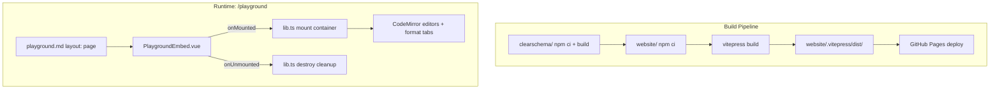

# feat: Add VitePress documentation website with embedded playground

## Overview

Build a VitePress-based documentation website that consolidates all existing documentation (README, GRAMMAR, ARCHITECTURE, CHANGELOG) into a navigable, searchable site with an embedded playground. Replaces the standalone playground GitHub Pages deployment with a unified docs-and-playground experience.

## Problem Frame

ClearSchema's documentation is scattered across GitHub markdown files with no navigable docs site. The existing browser playground deploys as a standalone app with no surrounding context. A proper documentation website is the highest-leverage adoption move now that all core features are shipped. (see origin: `docs/brainstorms/2026-04-05-docs-website-requirements.md`)

## Requirements Trace

- R1. VitePress site in `website/` with own `package.json`
- R2. GitHub Actions deployment replacing `deploy-playground.yml`
- R3. Built-in local search
- R4. Responsive design with dark/light mode
- R5. Landing page with hero, static code example, feature highlights, use case cards
- R6–R9. Documentation pages: Getting Started, Installation, CLI Reference, API Reference
- R10–R13. Syntax Guide pages: Types, Modifiers, References, Composition
- R14–R15. Exporter Reference pages (6 total) with CLI/API usage, options, examples
- R16–R18. Playground embedded as full-width client-only page at `/playground`
- R19. Add Zod format tab to playground
- R20–R21. Content migrated from existing docs; CHANGELOG rendered at `/changelog`

## Scope Boundaries

- No custom domain, blog, i18n, versioned docs, or user accounts
- VS Code extension / LSP docs out of scope for initial launch
- No interactive inline editors in docs pages — playground is its own page
- Old playground URLs accepted as breaking change (note in changelog)
- Phase docs (`docs/phases/`) not migrated — internal development history

## Context & Research

### Relevant Code and Patterns

- `playground/src/main.ts` — imperative DOM construction, module-level singletons
- `playground/src/editor.ts` — CodeMirror `EditorView` singleton, no destroy export
- `playground/src/output.ts` — 5 format tabs (missing Zod), output `EditorView` singleton
- `playground/src/styles.css` — global `*` reset, `html/body/#app` styles that collide with VitePress
- `playground/src/sharing.ts` — `lz-string` URL hash encoding, `VALID_FORMATS` array
- `playground/src/examples.ts` — `?raw` imports from `../../examples/*.clear`
- `playground/vite.config.ts` — `fs`/`path`/`fs/promises` aliased to `/dev/null`
- `clearschema/src/index.ts` — 40+ exports including all 6 exporters, importer, serializer
- `.github/workflows/deploy-playground.yml` — current GitHub Pages deployment

### External References

- [VitePress Getting Started](https://vitepress.dev/guide/getting-started)
- [VitePress SSR Compatibility](https://vitepress.dev/guide/ssr-compat) — `<ClientOnly>`, `defineClientComponent`
- [VitePress Custom Layouts](https://vitepress.dev/reference/default-theme-layout) — `layout: home`, `layout: page`, custom registered layouts
- [VitePress Deployment](https://vitepress.dev/guide/deploy) — GitHub Pages with `actions/deploy-pages@v4`

## Key Technical Decisions

- **VitePress in `website/` directory**: Own `package.json` with `"@clearschema/core": "file:../clearschema"` as a local dependency. This ensures Vite's dep optimizer handles CJS-to-ESM conversion (direct `resolve.alias` to `dist/` bypasses the optimizer and CJS `exports.*` syntax fails in the browser). Playground dependencies (codemirror, lz-string, etc.) also listed in `website/package.json`.
- **Playground entry point split**: Refactor playground into `playground/src/lib.ts` (exports `mount(container)`/`destroy()`) and `playground/src/main.ts` (imports lib and auto-mounts as Vite entry). The website imports only `lib.ts`. No conditional auto-mount detection needed.
- **Playground mount/destroy API**: `mount(container)` creates all DOM inside the given container (no `document.getElementById` for layout elements — all references scoped to container). `destroy()` calls `EditorView.destroy()` on both instances, removes global event listeners (e.g., click handler for dropdown close), clears debounce timer, nulls module singletons, removes child nodes.
- **`defineClientComponent` for SSR safety**: VitePress utility handles dynamic import + `<ClientOnly>` wrapping. Playground code never runs during SSR build.
- **`layout: page` for playground**: Uses VitePress's built-in `layout: page` (navbar present, no sidebar, no doc styling). Full-height playground achieved via CSS in `custom.css`, not a custom layout component. Only introduce `PlaygroundLayout.vue` if `layout: page` proves insufficient.
- **Landing page `layout: home`**: VitePress default hero/features frontmatter plus `home-features-after` slot for custom use case cards section.
- **Static code example on landing page**: Syntax-highlighted ClearSchema + output blocks, not an interactive editor. Consistent with scope boundary.
- **Sidebar sections renamed**: "Getting Started" (install, first steps) and "Reference" (CLI, API) instead of ambiguous "Docs". "Guide" and "Exporters" sections remain as-is.
- **Hand-written markdown for exporter pages**: Auto-generation is premature for 6 pages. Content partly exists in README use case sections.
- **Node built-in aliases**: VitePress Vite config replicates `fs`/`path`/`fs/promises` → `/dev/null` aliases for `@clearschema/core` browser compatibility.
- **Build `clearschema/` as prerequisite**: Deployment workflow runs `cd clearschema && npm ci && npm run build` before `cd website && npm ci && npx vitepress build`, since the `file:../clearschema` dependency resolves from the local built output.
- **Trigger paths**: Deployment triggers on changes to `website/**`, `clearschema/src/**`, `examples/**`, `CHANGELOG.md`.

## Open Questions

### Resolved During Planning

- **Landing page "live example"**: Static syntax-highlighted code block (ClearSchema input + JSON Schema/TypeScript output). Not interactive — matches scope boundary. Uses VitePress code blocks with `clearschema` language hint.
- **Exporter pages auto-generate or hand-write?**: Hand-written markdown. Only 6 pages, content partly exists. Auto-generation tooling is premature.
- **CodeMirror lifecycle cleanup**: Refactor playground to export `mount(container)`/`destroy()` API rather than reaching into module singletons. `destroy()` calls `EditorView.destroy()` on both editor instances, clears timers, nulls singletons.
- **Sidebar naming**: "Getting Started" and "Reference" replace ambiguous "Docs" section label.
- **Old playground URL breakage**: Accepted. The standalone playground has minimal external links. Note migration in changelog.
- **`@clearschema/core` resolution**: Local `file:../clearschema` dependency in `website/package.json`. Vite's dep optimizer handles CJS-to-ESM conversion automatically for dependencies in `node_modules`. Direct `resolve.alias` to `dist/` was rejected because it bypasses the optimizer.
- **GitHub Pages conflict**: GitHub Pages allows only one deployment source per repository. The VitePress deployment replaces `deploy-playground.yml` entirely — running both is not possible.

### Deferred to Implementation

- Exact VitePress theme color customization (brand colors, gradients)
- Whether to include the `Schema` AST type in API Reference (useful for programmatic users, low cost to add)
- Whether to add "Try in Playground" deep-links from exporter pages (deferred to follow-up, structure pages to support it later)

## High-Level Technical Design

> *This illustrates the intended approach and is directional guidance for review, not implementation specification. The implementing agent should treat it as context, not code to reproduce.*

```
website/                          ← new VitePress project
├── .vitepress/
│   ├── config.ts                 ← nav, sidebar, search, Vite aliases, base path
│   └── theme/
│       ├── index.ts              ← extends default theme
│       ├── custom.css            ← brand colors, scoped playground styles
│       └── components/
│           └── PlaygroundEmbed.vue   ← client-only wrapper calling mount/destroy
├── index.md                      ← layout: home (hero, features, use cases)
├── getting-started/
│   ├── introduction.md
│   └── installation.md
├── reference/
│   ├── cli.md
│   └── api.md
├── guide/
│   ├── types.md
│   ├── modifiers.md
│   ├── references.md
│   └── composition.md
├── exporters/
│   ├── json-schema.md
│   ├── typescript.md
│   ├── pydantic.md
│   ├── zod.md
│   ├── openapi.md
│   └── llm-schema.md
├── playground.md                 ← layout: page (no sidebar, full-width)
├── changelog.md                  ← sources from root CHANGELOG.md
└── package.json                  ← vitepress, file:../clearschema, codemirror, lz-string
```



## Implementation Units

- [ ] **Unit 1: VitePress project scaffolding and configuration**

**Goal:** Create the `website/` directory with VitePress config, theme setup, Vite aliases, and a minimal index page that builds successfully.

**Requirements:** R1, R3, R4

**Dependencies:** None

**Files:**
- Create: `website/package.json`
- Create: `website/.vitepress/config.ts`
- Create: `website/.vitepress/theme/index.ts`
- Create: `website/.vitepress/theme/custom.css`
- Create: `website/index.md` (minimal placeholder with `layout: home`)
- Create: `website/.gitignore` (node_modules, .vitepress/cache, .vitepress/dist)

**Approach:**
- `package.json` with `vitepress` as dev dependency, `"@clearschema/core": "file:../clearschema"` as dependency (local, Vite optimizer handles CJS-to-ESM), plus playground dependencies: `codemirror`, `@codemirror/lang-json`, `@codemirror/lang-javascript`, `@codemirror/lang-python`, `@codemirror/language`, `lz-string`
- `config.ts`: set `title`, `description`, `base` (repo name for GitHub Pages), `themeConfig.search.provider: 'local'`, `themeConfig.nav` with all top-level links, `themeConfig.sidebar` with path-based sections
- Vite config section: `resolve.alias` for `fs`, `path`, `fs/promises` → `/dev/null` (required for `@clearschema/core` browser compat)
- Theme `index.ts`: extend default theme, import `custom.css`
- Verify: build `clearschema/` first (`cd clearschema && npm run build`), then `cd website && npm install && npx vitepress build` succeeds

**Patterns to follow:**
- VitePress standard project structure from official docs
- Existing `playground/vite.config.ts` for Node.js built-in aliases

**Test scenarios:**
- Test expectation: none — scaffolding with no behavioral code. Verified by successful VitePress build.

**Verification:**
- `npx vitepress build` completes without errors
- `npx vitepress dev` serves the placeholder landing page with nav links
- Search icon appears in navbar

---

- [ ] **Unit 2: Landing page**

**Goal:** Build the home page with hero section, static code example, feature highlights, and use case cards.

**Requirements:** R5, R20

**Dependencies:** Unit 1

**Files:**
- Modify: `website/index.md` (replace placeholder with full landing page)
- Create: `website/.vitepress/theme/components/UseCases.vue` (optional — only if VitePress home features layout is insufficient for use case cards)
- Modify: `website/.vitepress/theme/index.ts` (register layout slots if custom component needed)
- Modify: `website/.vitepress/theme/custom.css` (hero gradient, brand colors)

**Approach:**
- Use `layout: home` frontmatter with `hero` (name, text, tagline, action buttons) and `features` (6-8 feature cards)
- Hero actions: "Get Started" → `/getting-started/introduction`, "Try Playground" → `/playground`
- Static code example: ClearSchema input + JSON Schema output in fenced code blocks below the features, or use `home-features-after` slot
- Use case cards: "API Schemas", "TypeScript Types", "Python Models", "LLM Structured Output", "Zod Validators", "Import Existing Schemas" — sourced from README "Use Cases" section
- Content migrated from README: hero text from opening lines, features from "Features" section, use cases from "Use Cases" section, comparison table from "Why ClearSchema?"

**Patterns to follow:**
- VitePress `layout: home` frontmatter format
- README.md lines 1-5 for hero text, lines 171-186 for comparison table, lines 190-238 for use cases

**Test scenarios:**
- Test expectation: none — static content page. Verified visually.

**Verification:**
- Landing page renders with hero, features grid, use case cards, and static code example
- "Get Started" and "Try Playground" buttons link to correct paths
- Dark mode toggle works and all sections are readable in both modes

---

- [ ] **Unit 3: Documentation content pages (Getting Started, Installation, CLI, API)**

**Goal:** Create the four core documentation pages, migrating content from README.md and writing new API reference content.

**Requirements:** R6, R7, R8, R9, R20

**Dependencies:** Unit 1

**Files:**
- Create: `website/getting-started/introduction.md`
- Create: `website/getting-started/installation.md`
- Create: `website/reference/cli.md`
- Create: `website/reference/api.md`

**Approach:**
- **Introduction/Getting Started** (R6): Quick walkthrough — install, create a `.clear` file, run CLI export. Sourced from README "Quick Example" + "Installation" sections. Target: reader completes in under 2 minutes.
- **Installation** (R7): npm install, global CLI install, programmatic import. Sourced from README "Installation" + "API Usage" sections.
- **CLI Reference** (R8): All commands (`clearschema <file>`, `clearschema import <file>`), all flags (`-f`, `-o`, `--schema-version`), examples for each exporter format. Sourced from README "CLI Usage" section.
- **API Reference** (R9): New writing. Document each public export: `parse`, `exportJsonSchema`, `exportTypeScript`, `exportPydantic`, `exportOpenAPI`, `exportZod`, `exportLlmSchema`, `importJsonSchema`, `exportClearSchema`, `resolveReferences`, `resolveImports`. Include function signatures, parameter descriptions, return types, and usage examples. Source: `clearschema/src/index.ts` exports + existing README "API Usage" section.

**Patterns to follow:**
- README.md lines 94-167 for CLI and API content
- VitePress markdown features: code groups, custom containers, line highlighting

**Test scenarios:**
- Test expectation: none — static content pages. Verified by proofreading and link checking.

**Verification:**
- All four pages render correctly with proper sidebar navigation
- Code examples have correct syntax highlighting
- Getting Started guide is completable end-to-end (install → schema → export)

---

- [ ] **Unit 4: Syntax Guide pages (Types, Modifiers, References, Composition)**

**Goal:** Create the four syntax guide pages covering the full ClearSchema DSL.

**Requirements:** R10, R11, R12, R13, R20

**Dependencies:** Unit 1

**Files:**
- Create: `website/guide/types.md`
- Create: `website/guide/modifiers.md`
- Create: `website/guide/references.md`
- Create: `website/guide/composition.md`

**Approach:**
- Content sourced from `docs/GRAMMAR.md` (EBNF spec + syntax examples) and README "Features" + "Syntax Examples" sections
- **Types** (R10): Primitives, objects, arrays, tuples, maps, unions — with examples for each. Source: GRAMMAR.md type definitions + README "Type System" section + `examples/` files
- **Modifiers** (R11): Inline (`.required`, `.nullable`), block (`^ key: value`), type-prefixed (`^ string.minLength: 3`), all constraint types by category (string, number, array, universal). Source: GRAMMAR.md modifier grammar + README "Modifiers" section + `docs/ARCHITECTURE.md` modifier system
- **References** (R12): `$defs` declarations, `$ref` usage, `import:` with specific and wildcard imports, file resolution. Source: GRAMMAR.md reference grammar + README "Schema References" section
- **Composition** (R13): `allOf`, `anyOf`, `oneOf` syntax and semantics, union types. Source: GRAMMAR.md composition grammar + README "Composition Types" section

**Patterns to follow:**
- `docs/GRAMMAR.md` for EBNF definitions and syntax examples
- `examples/user.clear`, `examples/ecommerce.clear` for realistic examples

**Test scenarios:**
- Test expectation: none — static content pages. Verified by proofreading.

**Verification:**
- All four pages render with correct ClearSchema code examples
- Each type/modifier/reference/composition construct is documented with at least one example
- Sidebar "Guide" section shows all four pages in correct order

---

- [ ] **Unit 5: Exporter Reference pages (6 pages)**

**Goal:** Create one reference page per exporter format.

**Requirements:** R14, R15, R20

**Dependencies:** Unit 1

**Files:**
- Create: `website/exporters/json-schema.md`
- Create: `website/exporters/typescript.md`
- Create: `website/exporters/pydantic.md`
- Create: `website/exporters/zod.md`
- Create: `website/exporters/openapi.md`
- Create: `website/exporters/llm-schema.md`

**Approach:**
- Each page follows a consistent template: description of what it produces, CLI usage example, API usage example, configuration options, output example, format-specific notes
- Content partially sourced from README "Use Cases" section and CHANGELOG feature descriptions
- Format-specific notes: JSON Schema (draft versions), TypeScript (interface vs type options, export keyword), Pydantic (smart type mapping, Field constraints), Zod (peer dependency, schema suffix convention), OpenAPI (server URL, API metadata config), LLM Schema (provider targets, constraint stripping, depth limits, circular ref detection)

**Patterns to follow:**
- README lines 190-238 for use case descriptions
- CHANGELOG.md for feature details per exporter
- `clearschema/src/exporters/` source files for option types

**Test scenarios:**
- Test expectation: none — static content pages. Verified by proofreading.

**Verification:**
- All six pages render with consistent structure
- CLI and API examples are accurate for each format
- Sidebar "Exporters" section shows all six pages

---

- [ ] **Unit 6: Refactor playground for mount/destroy API**

**Goal:** Refactor the existing playground source to export a `mount(container)` / `destroy()` API suitable for embedding in a Vue component. Add Zod format tab.

**Requirements:** R17, R19

**Dependencies:** None (can be done in parallel with Units 1-5)

**Files:**
- Create: `playground/src/lib.ts` (new — exports mount/destroy API)
- Modify: `playground/src/main.ts` (becomes thin entry: imports lib, calls mount on DOMContentLoaded)
- Modify: `playground/src/editor.ts` (add destroy export, scope DOM queries to container)
- Modify: `playground/src/output.ts` (add destroy export, add Zod format, scope DOM queries to container)
- Modify: `playground/src/sharing.ts` (add `'zod'` to `VALID_FORMATS`)
- Modify: `playground/src/clearschema-lang.ts` (no changes expected, but needed by imports)

**Approach:**
- **Entry point split**: Create `playground/src/lib.ts` that exports `mount(container: HTMLElement)` and `destroy()`. Move all imperative DOM construction from `main.ts` into `mount()`. `main.ts` becomes a thin Vite entry point: imports `{ mount }` from `./lib` and calls `mount(document.getElementById('app')!)` on `DOMContentLoaded`. The website imports only `lib.ts`.
- **Scoped DOM queries**: Replace `document.getElementById('format-tabs')` and similar global DOM queries in `output.ts` with references scoped to the container passed to `mount()`. Pass the container through to sub-modules or store as module-level ref.
- **Global event listener cleanup**: The `document.addEventListener('click', ...)` handler for dropdown close (in `main.ts`) must be tracked and removed in `destroy()`. Toast elements appended to `document.body` should instead be appended to the container.
- **Editor cleanup**: `editor.ts` exports `destroyEditor()` that calls `editorView.destroy()` and sets the singleton to null. Same for `output.ts` with `destroyOutputPanel()`.
- **Zod tab** (R19): Add `'zod'` to `Format` type union, `FORMAT_LABELS`, `ALL_FORMATS`, `languageForFormat` (returns `javascript`). Add case to `exportSchema` switch calling `exportZod`. Add `'zod'` to `VALID_FORMATS` in `sharing.ts`. Import `exportZod` from `@clearschema/core`.
- **CSS**: No changes to `playground/src/styles.css` — CSS scoping and global reset removal happen in Unit 7's `custom.css`.

**Patterns to follow:**
- Existing `output.ts` format handling pattern for adding Zod
- Existing `editor.ts`/`output.ts` creation pattern for mirror destroy functions

**Test scenarios:**
- Happy path: `mount(container)` creates editor and output panels inside the given container
- Happy path: `destroy()` removes all DOM children, destroys both CodeMirror instances
- Happy path: Calling `mount()` after `destroy()` re-creates the playground cleanly
- Happy path: Zod format tab renders Zod output for a valid schema
- Edge case: `destroy()` called when no editors exist (idempotent, no errors)
- Integration: Selecting Zod format tab in a shared URL restores correctly

**Verification:**
- Standalone playground still works (`cd playground && npm run dev`)
- Zod tab shows correct output for example schemas
- `mount()`/`destroy()` cycle works without errors or memory leaks

---

- [ ] **Unit 7: Playground Vue wrapper and page**

**Goal:** Create the PlaygroundEmbed Vue component and playground page that embeds the playground as a client-only full-width page within VitePress.

**Requirements:** R16, R17, R18

**Dependencies:** Unit 1, Unit 6

**Files:**
- Create: `website/.vitepress/theme/components/PlaygroundEmbed.vue`
- Create: `website/playground.md` (frontmatter: `layout: page`)
- Modify: `website/.vitepress/theme/index.ts` (no layout registration needed — uses built-in `layout: page`)
- Modify: `website/.vitepress/theme/custom.css` (scoped playground styles, full-height override for playground page)

**Approach:**
- **PlaygroundEmbed.vue**: Uses `defineClientComponent` (preferred — handles dynamic import + `<ClientOnly>` in one call) to wrap the playground. In the underlying component, `onMounted` dynamically imports `mount` from `playground/src/lib.ts` and calls it with a container ref. `onUnmounted` calls `destroy()`.
- **`layout: page` (built-in)**: VitePress's built-in `layout: page` provides the navbar but no sidebar or doc styling. Use CSS in `custom.css` to make the playground container fill the remaining viewport height below nav. Only introduce a custom `PlaygroundLayout.vue` if `layout: page` proves insufficient.
- **CSS scoping**: Playground styles from `playground/src/styles.css` adapted and scoped under `.playground-wrapper` in `custom.css`. Global resets (`*`, `html`, `body`, `#app`) excluded entirely — VitePress provides its own. CSS custom properties moved from `:root` to `.playground-wrapper`. CodeMirror theme overrides scoped similarly. Unit 6 does not modify `styles.css`; this unit creates the scoped version.
- **Example imports**: Vite resolves `?raw` imports relative to the source file location, so `playground/src/examples.ts` paths (`../../examples/*.clear?raw`) work correctly when imported from the website because the source file is still in `playground/src/`.
- **Playground in nav**: Already configured in Unit 1's `themeConfig.nav`.

**Patterns to follow:**
- VitePress `defineClientComponent` pattern from SSR Compatibility docs
- VitePress `layout: page` for full-width pages

**Test scenarios:**
- Happy path: Navigate to `/playground` — editor and output panels render, format tabs work
- Happy path: Type ClearSchema in editor — output updates live across all 6 format tabs
- Happy path: Share URL — hash encodes state, opening shared URL restores editor content and format
- Happy path: Navigate away from `/playground` to a docs page — no console errors or memory leaks
- Happy path: Navigate back to `/playground` — playground re-initializes cleanly
- Edge case: Load `/playground` directly (not via navigation) — renders correctly
- Edge case: Open `/playground` with a shared URL hash — state restores on initial load
- Integration: Dark/light mode toggle updates playground theme colors

**Verification:**
- Playground is fully functional within VitePress site
- Navigation to/from playground has no console errors
- Playground occupies full width below navbar, no sidebar visible
- All 6 format tabs produce correct output

---

- [ ] **Unit 8: Changelog page**

**Goal:** Render CHANGELOG.md as a page at `/changelog`.

**Requirements:** R21

**Dependencies:** Unit 1

**Files:**
- Create: `website/changelog.md`

**Approach:**
- VitePress can include content from other files. Simplest approach: copy/adapt CHANGELOG.md content into `website/changelog.md` with appropriate frontmatter (`title: Changelog`). Alternatively, use VitePress markdown `<!--@include: ../CHANGELOG.md-->` directive to include the root CHANGELOG.md directly.
- The `<!--@include-->` directive is preferred — single source of truth, no content drift.

**Patterns to follow:**
- VitePress markdown file inclusion syntax

**Test scenarios:**
- Test expectation: none — static content inclusion. Verified by rendering.

**Verification:**
- `/changelog` page renders all version entries from CHANGELOG.md
- Page appears in top-level navigation

---

- [ ] **Unit 9: GitHub Actions deployment workflow**

**Goal:** Replace `deploy-playground.yml` with a workflow that builds and deploys the VitePress site.

**Requirements:** R2

**Dependencies:** Unit 1 (write and test the workflow early with the placeholder site — catches deployment issues before all content is written)

**Files:**
- Modify: `.github/workflows/deploy-playground.yml` (replace contents entirely, or rename to `deploy-website.yml`)

**Approach:**
- Two-step build: first `clearschema/` (npm ci + npm run build), then `website/` (npm ci + npx vitepress build)
- Upload artifact from `website/.vitepress/dist/`
- Trigger on push to `main` with path filter: `website/**`, `clearschema/src/**`, `examples/**`, `CHANGELOG.md`
- Plus `workflow_dispatch` for manual triggers
- Same permissions and concurrency group as existing workflow
- Node 20, npm cache keyed to `website/package-lock.json`
- `fetch-depth: 0` for VitePress `lastUpdated` feature (git timestamps)

**Patterns to follow:**
- Existing `.github/workflows/deploy-playground.yml` structure
- VitePress GitHub Pages deployment guide

**Test scenarios:**
- Happy path: Push change to `website/` — workflow triggers, site deploys successfully
- Happy path: Push change to `clearschema/src/` — workflow triggers (core lib change may affect playground output)
- Edge case: Push change to unrelated path (e.g., `clearschema-lsp/`) — workflow does NOT trigger
- Error path: `clearschema/` build fails — workflow fails before VitePress build step

**Verification:**
- Workflow file passes GitHub Actions syntax validation
- Site is accessible at the GitHub Pages URL after deployment
- Old standalone playground URL now serves the VitePress site

## System-Wide Impact

- **Interaction graph:** The deployment workflow replaces `deploy-playground.yml`. The `ci.yml` and `release.yml` workflows are unaffected. The playground source in `playground/` gains a `mount`/`destroy` API in `lib.ts`; `main.ts` remains the standalone Vite entry point.
- **Error propagation:** VitePress build failure blocks deployment (good — prevents broken site). Core lib build failure blocks VitePress build (good — ensures fresh exports).
- **State lifecycle risks:** CodeMirror singleton lifecycle is the main risk — addressed by the refactored `mount`/`destroy` API in Unit 6 and Vue wrapper cleanup in Unit 7.
- **API surface parity:** No API changes to `@clearschema/core`. Playground adds Zod tab to match the existing 6 exporters.
- **Unchanged invariants:** The core library, CLI, LSP server, VS Code extension, CI workflow, and npm release workflow are all unmodified.

## Risks & Dependencies

| Risk | Mitigation |
|------|------------|
| VitePress SSR build fails on playground code (CodeMirror uses DOM APIs) | `defineClientComponent` / `<ClientOnly>` ensures playground code is never server-rendered |
| CSS collisions between playground and VitePress theme | Playground styles scoped to `.playground-wrapper`, global resets removed |
| `@clearschema/core` CJS-to-ESM conversion issues in Vite | Use `file:../clearschema` dependency (not `resolve.alias`) so Vite's dep optimizer handles CJS→ESM conversion in `node_modules` |
| CodeMirror memory leak on repeated navigation | `destroy()` API with explicit `EditorView.destroy()` calls in `onUnmounted` |
| `?raw` import paths break from new directory location | Adjust relative paths in example loading, or move examples import to the Vue wrapper |
| Old shared playground URLs break | Accepted — early stage with minimal external links. Document in changelog. |

## Documentation / Operational Notes

- Update root README.md to link to the docs site once deployed
- Add a note in CHANGELOG.md about the playground URL migration
- The `playground/` directory is kept as the source for the embedded component; `main.ts` still works as the standalone Vite entry point for development

## Sources & References

- **Origin document:** [docs/brainstorms/2026-04-05-docs-website-requirements.md](docs/brainstorms/2026-04-05-docs-website-requirements.md)
- Playground source: `playground/src/`
- Core library exports: `clearschema/src/index.ts`
- Current deployment: `.github/workflows/deploy-playground.yml`
- VitePress docs: https://vitepress.dev
